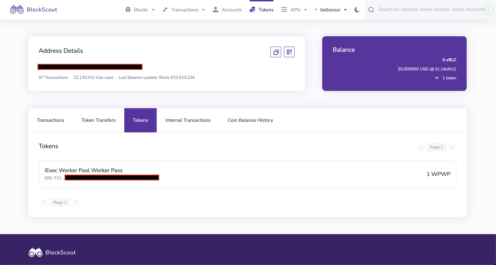
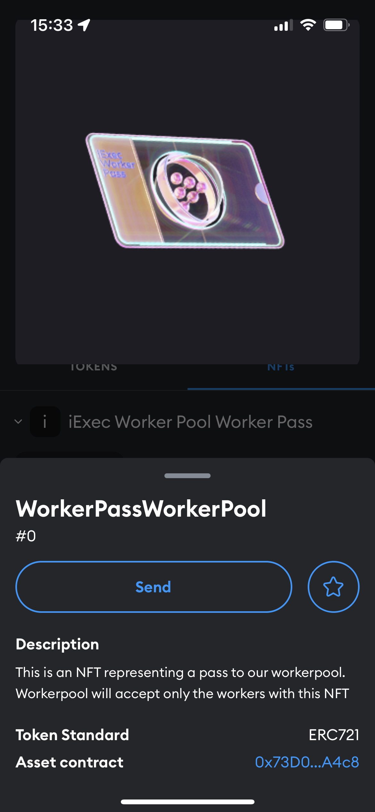
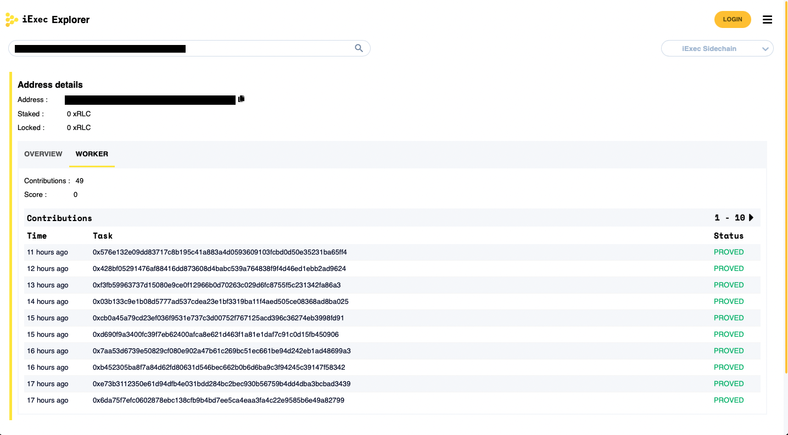
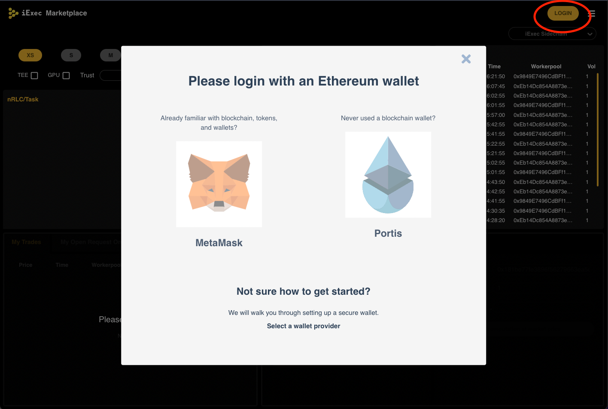
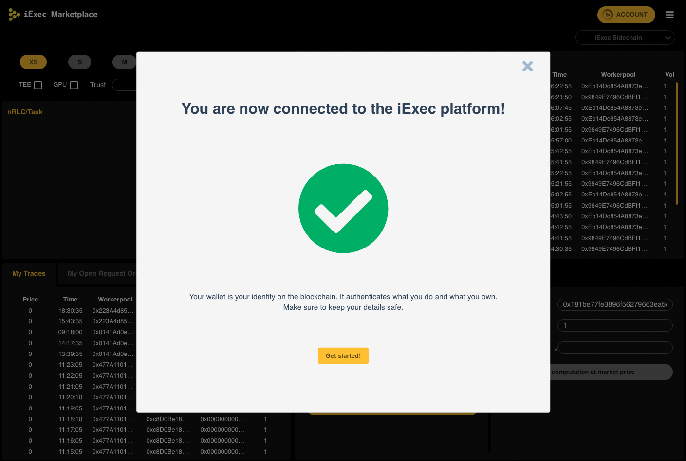
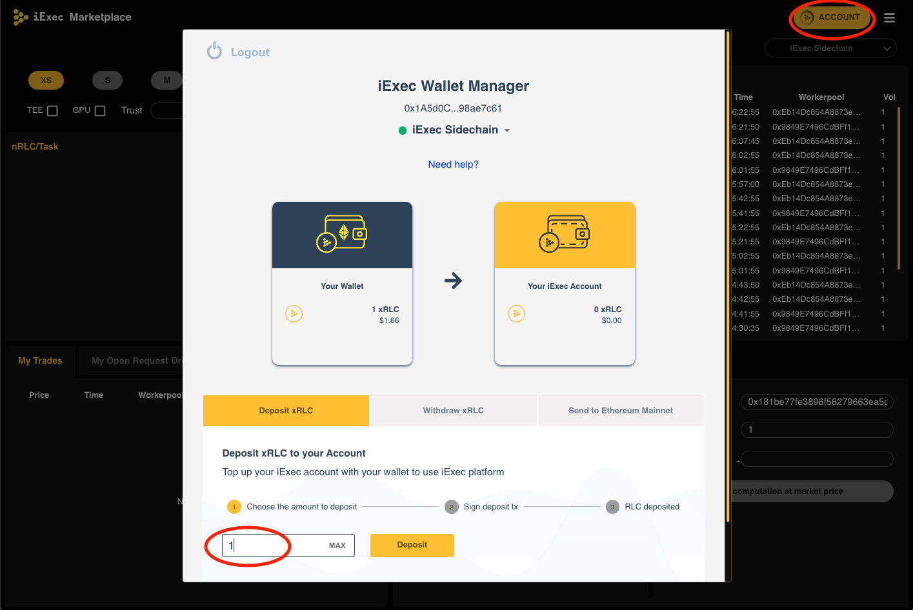
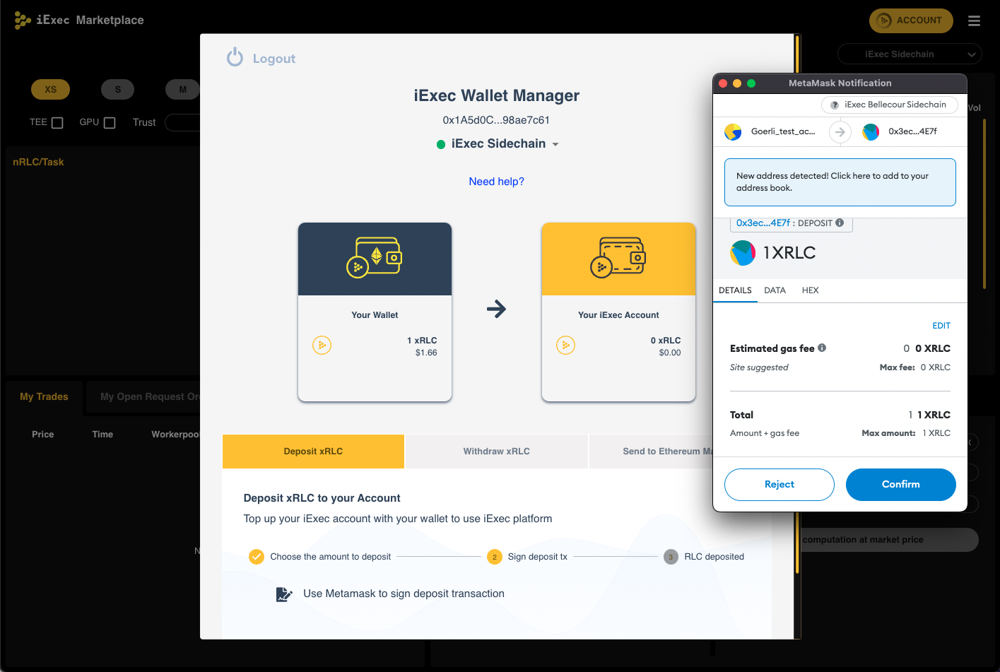
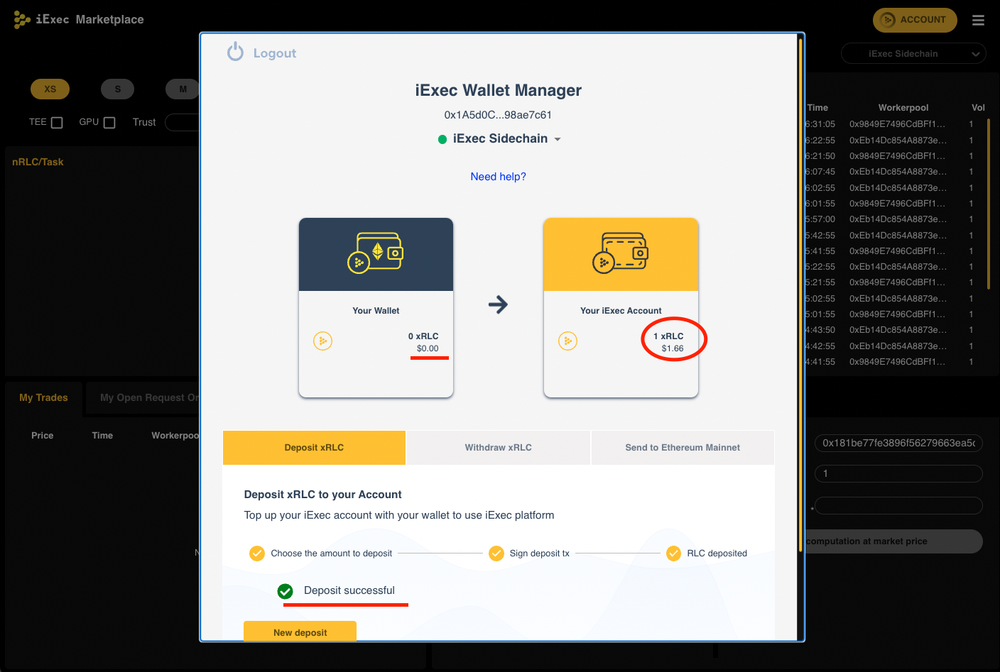
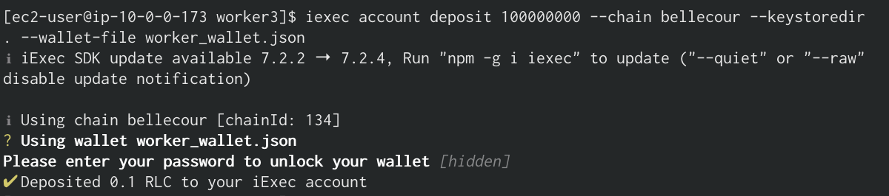

# README #

This README document the required steps to deploy a worker and join the public [Worker Pass Worker Pool](https://explorer.iex.ec/bellecour/workerpool/0x35684fc93dc7e0645d7145a028dd9f7ee954a08c)

## What is this repository for? ##

* In this repository we show 3 ways of deploying your worker:
    * **[Using vagrant](https://github.com/iExecBlockchainComputing/wpwp-worker-setup/tree/main/vagrant-deployment)** - this is a one-click deployment for less advanced users. If you don't know how to use a command line and docker this is an option for you
    * **[Using docker-compose](https://github.com/iExecBlockchainComputing/wpwp-worker-setup/tree/main/docker-deployment)** - for more advanced users. This gives you more control over your worker and allows you to easier debug issues. To follow these steps you need to know how to use docker. We won't teach you the basics. In this tutorial, we assume you've already used docker and docker-compose
    * **[Using cloud](https://github.com/iExecBlockchainComputing/wpwp-worker-setup/tree/main/cloud-deployment)** provisioned VM like AWS EC2 or Azure VM - for users who want to deploy the worker in a cloud. This tutorial is for really advanced users who know how to provision computing resources and connect to them. We won't teach you how to do it - we assume you know. In this tutorial, we provide you with a one-click script to fast and easily configure your Virtual Machine and deploy a worker in a cloud
* Version: 1.0.0

---

## FAQ

### 1. When can I join the pool ###

The pool will accept only workers who hold WorkerPassWorkerPool NFT tokens in their wallets. 
This is only a utility NFT that gives the holder access to the pool. 
A worker without the token will be automatically removed from the pool.

### 2. How can I get the token? ###

You can participate in a token drop over this link - [workerpass.iex.ec](https://workerpass.iex.ec)
We will organize 3 drops and you'll have a chance to participate.
First people confirming, that they are willing to spin their workers and accept terms and conditions, will be granted the token.

### 3. How can I verify if I own the NFT ###

Visit: [https://blockscout-bellecour.iex.ec/address/your_wallet_address/tokens](https://blockscout-bellecour.iex.ec/) and verify if you hold the WPWP token   


### 4. How do I add my NFT to my metamask

It's easy, follow the steps in this [video tutorial](https://www.youtube.com/watch?v=nNjiNvQ3b7o)
1. Add iExec Sidechain as a new network in your metamask.
    * Network Name: iExec Bellecour Sidechain
    * New RPC URL: https://bellecour2.iex.ec
    * Chain ID: 134
    * Currency symbol: xRLC
    * Block explorer URL: https://blockscout-bellecour.iex.ec
2. Click on Assets -> NFTs and import a new NFT.
    * NFT address: 0x73D0801b1e1e4c9a73680515b668B73e77EFA4c8
    * ID: Follow point 3 of this FAQ and find the Token ID corresponding to your wallet in the [token inventory](https://blockscout-bellecour.iex.ec/tokens/0x73D0801b1e1e4c9a73680515b668B73e77EFA4c8/inventory)
3. Properly imported Worker Pass Workerpool NFT should look like that:

   

### 5. How can I check my rewards? ###

Visit: [https://blockscout-bellecour.iex.ec/address/your_wallet_address/tokens](https://blockscout-bellecour.iex.ec/) and check the balance of your wallet.   


### 6. How do I monitor my worker ###

You can as well verify the number of tasks your worker executed using iExec Explorer


### 7. How can I verify if my worker correctly joined a workerpool? ###

Visit our [grafana](https://grafana.workerpass.iex.ec/) page and look for your wallet in an Active Worker List. If your worker is there it means it is properly connected.

### 8. What if my worker is not executing new tasks or is stuck ###

In that case, restart the worker and restart the machine. If that didn't help contact iex.ec support.

### 9. How do I stake my RLC

In order to participate in a WPWP campaign you need to stake 1 RLC.
Staking is really easy. You can do it using a terminal or using our [iExec market](https://market.iex.ec/). 

1. [iExec market](https://market.iex.ec/) version
    * Visit [iExec market](https://market.iex.ec/) page
    * Login - in this case, we will log in with metamask

        

        

    * Click on the account in the top right corner and click deposit. For Worker Pass Worker Pool you'll need to deposit/stake 1 RLC

        

    * Once you click on the deposit button, metamask will pop up and will ask you to confirm the transaction

        

    * Congratulations! You've just staked your first RLC

        
    
2. For more advanced users you can do it using iExec CLI
    * Setup iExec CLI and import your wallet
        ```sh
        npm install -g iexec # Install iexec
        mkdir iexec_wallet # Create a new directory
        cd iexec_wallet # Change the directory to the one you've created
        iexec init --skip-wallet # Iniciate iexec
        iexec wallet import <privatekey> --keystoredir . # import your wallet
        ```
    
    * Deposit 1 RLC

        ```sh
            iexec account deposit 1 RLC --chain bellecour --keystoredir . --wallet-file worker_wallet.json
        ```

        


---

## Disclaimer

1. Unfortunately, you can't yet run a worker in ARM-based CPU - ( Worker runs only on 64-bit (x84) architecture). It implies that it is **not possible** to run the worker on e.g. MacBooks with M1/M2 ARM-based silicons or AWS EC2 t4g instances. 
2. Keep your connection to the pool as stable as possible. If you multiple times fail tasks by disconnecting and timing out the tasks, your worker will be punished by PoCo protocol. You might lose your stake or your worker won't receive new tasks and consequently might get blacklisted from the pool.
3. Instead of burning electricity on the dummy tasks, we support Scientific Research in Physics and Astronomy - [Universe@Home](https://universeathome.pl/universe/description.php). With the Worker Pass Workerpool campaign, we will together discover the cosmos and search for black holes by supporting University Research. It means that our infrastructure is dependent on the Universe@Home scheduler. If their servers go down we won't be able to offer the tasks. In that scenario, we have a backup dApps with prime numbers research project.


---

## Who do I talk to? ##

* [Open a support ticket](https://iexecproject.atlassian.net/servicedesk/customer/portal/4/group/9/create/73)
