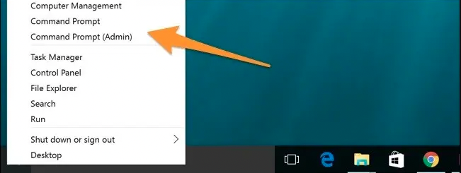
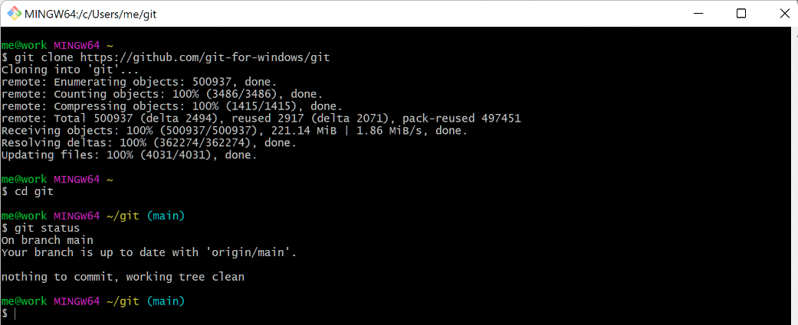

# README #

Run iExec Worker

* Quick summary - This README documents the steps to set up a worker and join a workerpool using Vagrant
    * [Vagrant](https://www.vagrantup.com/) - an open-source software product for building and maintaining portable virtual software development environments
    * [VirtualBox](https://www.virtualbox.org/) - an open-source powerful virtualization product for enterprise as well as home use
* Version - 1.0.0

---

## How do I get set up? ##

Remember your worker needs to have WorkerPassWorkerPool NFT on your wallet to join Worker Pass Worker Pool.

To confirm you have that NFT visit:   
[https://blockscout-bellecour.iex.ec/address/YourWalletaddress/tokens](https://blockscout-bellecour.iex.ec/address/0x587dcc67c6AB1ea86E4AA043a1282d584B05BFCc/tokens)

After you verified that you have the NFT in your wallet please confirm you have installed all dependencies mentioned in the Prerequisites step.   

## Prerequisites

In this step pick your operationg system - Linux/Macos/Windows and follow the steps


### Prerequisites Windows ###

* A Good Internet connection.

* Install the following tools on your machine
    * [Vagrant- 2.3.2](https://developer.hashicorp.com/vagrant/downloads)
    * [Oracle VM VirtualBox - 7.X](https://www.virtualbox.org/wiki/Downloads)
    * [Git](https://git-scm.com/download/win)

* Open termianl - Press Windows+X to open the Power Users menu, and then click “Command Prompt” or “Command Prompt (Admin).”


Or use terminal provided by git-bash you've installed in the previous step:


* Verify the number of CPUs on your machine using terminal:  

    ```sh
    $ wmic cpu get NumberOfCores,NumberOfLogicalProcessors
    NumberOfCores  NumberOfLogicalProcessors
    6              12
    ```

    In this machine, we have 6 cors

    Or follow the instructions from this [link](https://www.top-password.com/blog/find-number-of-cores-in-your-cpu-on-windows-10/)
    
    ( This number will be required soon while configuring the Vagrant file.)

### Prerequisites Linux ###

* Good Internet connection.

* Step 1: Update Ubuntu Packages

    ```sh
    sudo apt-get update -y
    sudo apt-get -y install git-all
    ```
    
* Step 2: Install VirtualBox

    ```sh
    sudo apt install virtualbox
    ```

* Step 3: Install Vagrant

    ```sh
    sudo apt-get -y install vagrant
    # Verify installation
    vagrant --version
    ```

* Verify the number of CPUs on your machine:

    ```sh
    $ echo "Threads/core: $(nproc --all)"

    CPU threads: 4
    ```
    
    In this machine, there are 4 cores
    
    (This number will be required soon while configuring the Vagrant file.)

### Prerequisites MacOs ###
 
Remember this instruction won't work on the newest Macbook with M1 silicon

* Good Internet connection.

* Step 0: Open Terminal - click Command+Space, type terminal and press enter

* Step 1: Install homebrew package manager and git

    ```sh
    # Install brew
    /bin/bash -c "$(curl -fsSL https://raw.githubusercontent.com/Homebrew/install/HEAD/install.sh)"
    brew update
    brew upgrade
    brew cleanup

    # Install git
    brew install git
    ```
    
* Step 2: Install VirtualBox

    ```sh
    brew install --cask virtualbox
    ```

* Step 3: Install Vagrant

    ```sh
    brew install --cask vagrant
    ```

* Verify the number of CPUs on your machine:

    ```sh
    $ sysctl hw.physicalcpu
    hysicalcpu
    hw.physicalcpu: 16
    ```
    
    In this machine, there are 16 cores
    
    (This number will be required soon while configuring the Vagrant file.)

### Configure Project ###

Execute the following command to provision your iExec-Worker VM.  

0. Open terminal 
 

1. First clone/download this repository - `git clone https://github.com/iExecBlockchainComputing/wpwp-worker-setup.git`
2. Change directory to vagrant-deployment `cd ./wpwp-worker-setup/vagrant-deployment`
    You can open this folder in explorer by using mouse cursor or terminal

    ```sh
    # Windows
    start .

    # MacOs
    open .

    # Ubuntu
    nautilus .
    ```

3. Configure the following variables in the `worker_config.properties` file in the `wpwp-worker-setup/vagrant-deployment/worker_config.properties` directory - you can use your prefered file viewer like notepad or VScode to modify it.

    * WALLET_PRIVATE_KEY: This must be configured when you want to setup the worker with your existing wallet. You must not set this value if you want to create a new wallet.   
    You can get your private key from metamask by following [this tutorial](https://metamask.zendesk.com/hc/en-us/articles/360015289632-How-to-export-an-account-s-private-key#:~:text=On%20the%20account%20page%2C%20click,click%20%E2%80%9CConfirm%E2%80%9D%20to%20proceed.)

        ```sh
        WALLET_PRIVATE_KEY=0x11627cbb3542c6091a3d9f715f2c26820e2363facea87d0cd0aeae3a87f81cfd
        ```      

    * CREATE_NEW_WALLET: This must be set to 'yes' if you want to create a new wallet and 'no' in other cases:

        ```sh
        CREATE_NEW_WALLET=no
        ```
        
    * WALLET_PASSWORD: This must be the password of your existing wallet when you want to use your existing wallet or the password you want to set for your new wallet. (Change this password to the one you've used for your wallet)

        ```sh
        WALLET_PASSWORD=workerSecretPassword
        ``` 
        
    * WORKER_NAME: Name your worker which will be seen on the grafana portal.

        ```sh
        WORKER_NAME=My_First_Worker_Name
        ```     
        
4. Configure the following variables in the `Vagrantfile` in the path `wpwp-worker-setup/vagrant-deployment/Vagrantfile` - line 21:

    We recommend setting this variable to number of CPU cores available on your machine - 1 e.g. if you have 16 cores set this variable to a maximum of 15.
    
    This variable determines the maximum computing power you give to your worker. The more CPU cores are available for the worker the more RLC you'll earn.
   
    ```sh
    v.cpus = "1" # This is the number of CPUs you want to set for the Virtual Machine. It must be less than the number of CPUs available on your host machine.     
    ```

### Set up your VM (Virtual Machine) and Worker ###

Start your worker using Vagrant and VM. (Run this command in the terminal in the directory `wpwp-worker-setup/vagrant-deployment`)

```sh
vagrant up
```
This will provision a VM for your worker, create, start and connect your worker to our workerpool.

***Remember you need to have Worker Pass NFT on the worker's wallet.***   

When your worker setup is successfully completed you should see the following message on your screen.

```sh
Worker was successfully started.
```
First time The whole process will take time (around 10 to 20 mins). So be patient and grab some coffee! 


After worker starts successfully it will take 2 to 3 mins to join the worker pool.

You can confirm that by visiting [WorkerPass WorkerPool Grafana Portal](https://workerpool.iexecenterprise.com) 

You must see your worker name (WORKER_NAME) in the list of workers. You specified this name in the file `worker_config.properties` and its wallet.


   * While provisioning the VM, it will ask you to log in to the Vagrant user account, So please use 'vagrant' as a password and login into the account.
   
   * On VMs Desktop you will see the following iExec Launchers:    

      1. Launch iExec Worker: Double-click on it to launch your worker or to see the logs of your worker.  
          
      2. Stop iExec Worker: Double-click on it to Stop and remove your worker setup.        
      3. Website: Double-click on it, and it will open [iExec portal] (https://iex.ec/).         
      4. Statistics: Double click on it, and it will open [WPWP pool Grafana] (https://workerpool.iexecenterprise.com/)	  

### Additional commands ###

* Check your worker's private key:

    ```sh
    $ iexec wallet show --show-private-key --keystoredir . --wallet-file worker_wallet.json --password mySecretPassword
        ℹ Wallet file:
        privateKey: 0x7558ceabb955309e3725667974c81831531dddcc49ebafc1d6124f2a573b214d
        publicKey:  0x04a5302a43ff3acac78c16af2f584f2c197f076d81469ccfe95f52ffb061f31855a53e610675dcec94e25a42e5d3c45297fe8040347ab00b156bc03bcd4772f131
        address:    0x587dcc67c6AB1ea86E4AA043a1282d584B05BFCc
    ```

---

## Who do I talk to? ##

* [Open a support ticket](https://iexecproject.atlassian.net/servicedesk/customer/portal/4/group/9/create/73)
