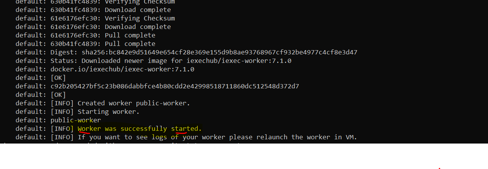
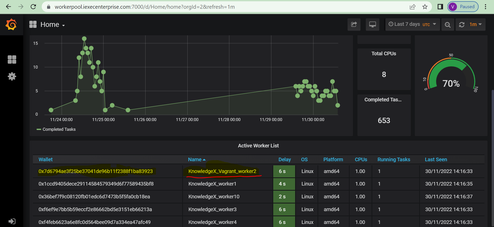
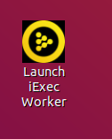

# README #

Run iExec Worker

* Quick summary - This README documents the steps to set up a worker and join a workerpool using Vagrant
* Version - 1.0.0

---

## How do I get set up? ##

Please confirm you have installed all dependencies mentioned in the Prerequisites step.   
Remember your worker needs to have WorkerPassWorkerPool NFT on your wallet to join Worker Pass Worker Pool.

To confirm you have that NFT visit:   
[https://blockscout-bellecour.iex.ec/address/YourWalletaddress/tokens](https://blockscout-bellecour.iex.ec/address/0x587dcc67c6AB1ea86E4AA043a1282d584B05BFCc/tokens)


### Prerequisites Windows ###

* A Good Internet connection.

* Install the following tools on your machine
    * [Vagrant- 2.3.2](https://developer.hashicorp.com/vagrant/downloads)
    * [Oracle VM VirtualBox - 7.X](https://www.virtualbox.org/wiki/Downloads)
    
* Verify the number of CPUs on your machine using CMD:  

    ```sh
    $ wmic cpu get NumberOfCores,NumberOfLogicalProcessors
    NumberOfCores  NumberOfLogicalProcessors
    6              12
    ```

    In this machine, we have 6 cors

    Or follow the instructions from this [link](https://www.top-password.com/blog/find-number-of-cores-in-your-cpu-on-windows-10/)
    
    ( This number will be required soon while configuring the Vagrant file.)

### Prerequisites Linux and macOS ###

* Good Internet connection.

* Step 1: Update Ubuntu Packages

    ```sh
    sudo apt-get update -y &&
    sudo apt-get -y install git-all &&
    ```
    
* Step 2: Install VirtualBox

* Step 3: Install Vagrant


* Verify the number of CPUs on your machine:

    ```sh
    $ lscpu | egrep 'Model name|Socket|Thread|NUMA|CPU\(s\)'

    CPU(s):              4
    On-line CPU(s) list: 0-3
    Thread(s) per core:  2
    Socket(s):           1
    NUMA node(s):        1
    Model name:          AMD EPYC 7571
    NUMA node0 CPU(s):   0-3
    
    # If the above command doesn't work try the following
    $ echo "Threads/core: $(nproc --all)"

    CPU threads: 4
    ```
    
    In this machine, there are 4 cores
    
    (This number will be required soon while configuring the Vagrant file.)

### Configure Project ###

Execute the following command to provision your iExec-Worker VM

1. First clone/download this repository - `git clone git@github.com:iExecBlockchainComputing/wpwp-worker-setup.git`
2. Change directory to vagrant-deployment `cd ./wpwp-worker-setup/vagrant-deployment`
3. Configure the following variables in the worker_config.properties file.
    * WALLET_PRIVATE_KEY: This must be set when you want to set your worker with your existing wallet. You must not set this value if you want to create a new wallet. 

        ```sh
        WALLET_PRIVATE_KEY=0x11627cbb3542c6091a3d9f715f2c26820e2363facea87d0cd0aeae3a87f81cfd
        ```      

    * CREATE_NEW_WALLET: This must be set to 'yes' if you want to create a new wallet and 'no' in other cases:

        ```sh
        CREATE_NEW_WALLET=no
        ```
        
    * WALLET_PASSWORD: This must be the password of your existing wallet when you want to use your existing wallet or the password you want to set for your new wallet. (Change this password to the one you've used for your wallet)

        ```sh
        WALLET_PASSWORD=workerSecretPassword
        ``` 
        
    * WORKER_NAME: Name your worker which will be seen on the grafana portal.

        ```sh
        WORKER_NAME=My_First_Worker_Name
        ```     
        
4. Configure the following variables in the Vagrant file:

    This is the number of CPUs available on your machine - 1
   
    ```sh
    v.cpus = "1" # This is the number of CPUs you want to set for the Virtual Machine. It must be less than the number of CPUs available on your host machine.     
    ```

### Set up your VM (Virtual Machine) and Worker ###

Start your worker using Vagrant and VM

```sh
vagrant up
```
This will provision a VM for your worker, craete, start and connect your worker to our workerpool.

***Remember you need to have Worker Pass NFT on the worker's wallet.***   

When your worker setup is successfully completed you should see the following message on your screen.

```sh
Worker was successfully started.
```
First time The whole process will take time. (around 10 to 20 mins). So be patient and take a cofee! 



After worker starts successfully it will take 2 to 3 mins to join the worker pool.

You can confirm that by visiting [WorkerPass WorkerPool Grafana Portal](https://workerpool.iexecenterprise.com) 

You must see your worker name (WORKER_NAME) in the list of workers. Which you have set in the file worker_config.properties and his wallet.



   * While provisioning the VM, it will ask you to log in to the Vagrant user account, So please use 'vagrant' as a password and login into the account.
   
   * On VMs Desktop you will see the following iExec Launchers:    

      1. Launch iExec Worker: Double-click on it to launch your worker or to see the logs of your worker.  
          
      2. Stop iExec Worker: Double-click on it to Stop and remove your worker setup.        
      3. Website: Double-click on it, and it will open [iExec portal] (https://iex.ec/).         
      4. Statistics: Double click on it, and it will open [WPWP pool Grafana] (https://workerpool.iexecenterprise.com/)	  

### Additional commands ###

* Check your worker's private key:

    ```sh
    $ iexec wallet show --show-private-key --keystoredir . --wallet-file worker_wallet.json --password mySecretPassword
        ℹ Wallet file:
        privateKey: 0x7558ceabb955309e3725667974c81831531dddcc49ebafc1d6124f2a573b214d
        publicKey:  0x04a5302a43ff3acac78c16af2f584f2c197f076d81469ccfe95f52ffb061f31855a53e610675dcec94e25a42e5d3c45297fe8040347ab00b156bc03bcd4772f131
        address:    0x587dcc67c6AB1ea86E4AA043a1282d584B05BFCc
    ```

---

## Who do I talk to? ##

* Repo owner or admin - jacek.janczura [at] knowledgex.com
* Open an issue in this repo